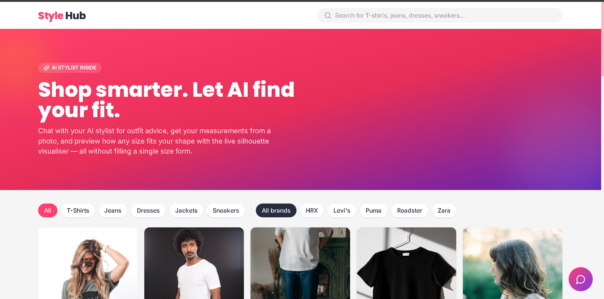
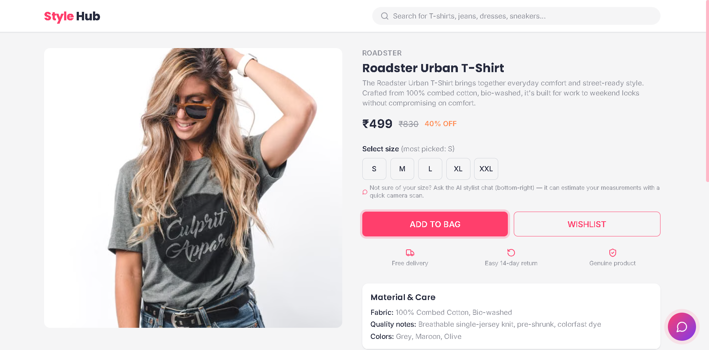
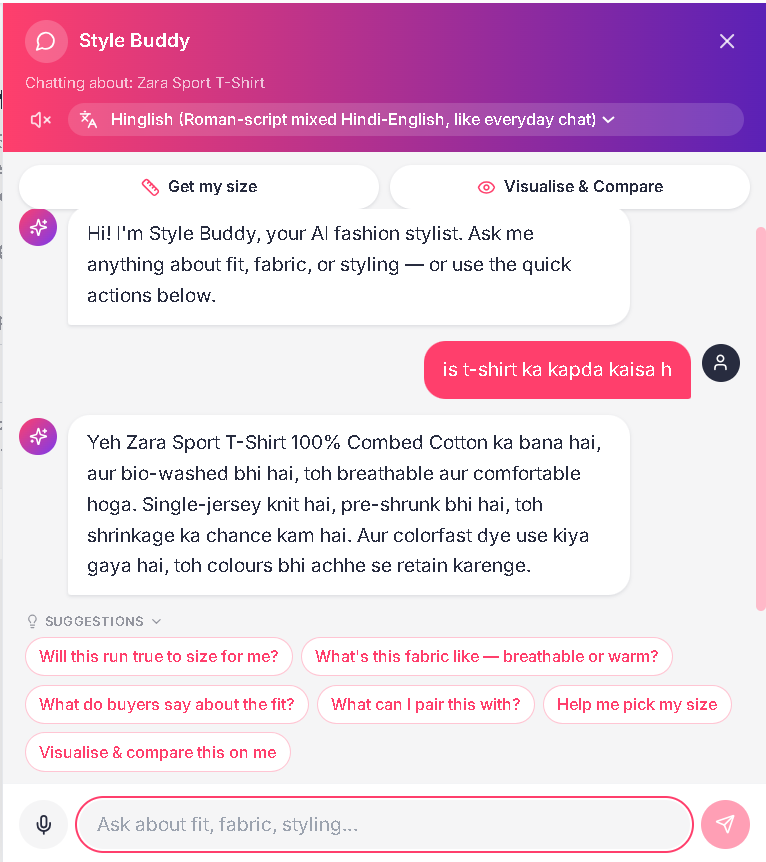
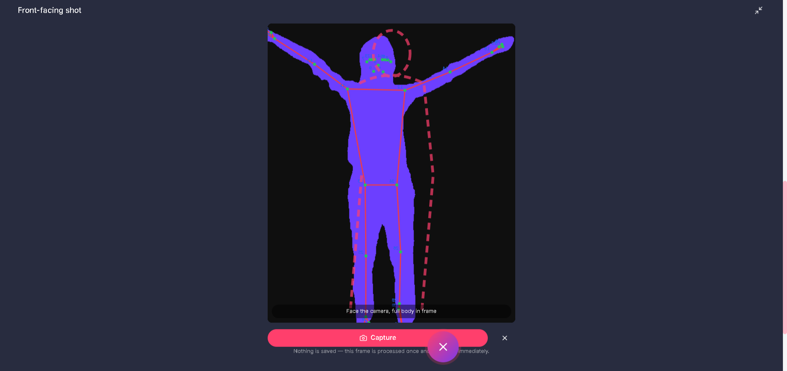
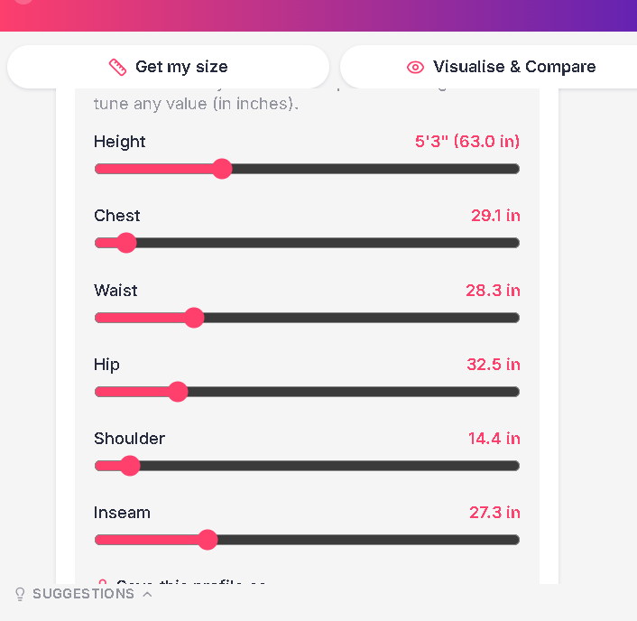
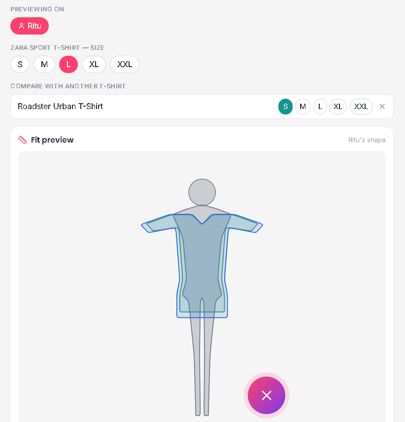

# FitSense — AI Fashion Shopping & Size Recommendation Platform

React
FastAPI
Python
MediaPipe
OpenCV
SQLite
TailwindCSS
Groq

🎥 Demo Video:
https://youtu.be/.....

🌐 Live Demo:
https://.....

Frontend and backend are deployed.
The body measurement microservice runs locally.

FitSense is a full-stack AI-powered fashion shopping platform that helps users choose the right clothing with confidence. It features an AI shopping assistant, real-time body measurement from live camera input, personalized size recommendations, and an interactive fit visualization built with React, FastAPI, MediaPipe, and SQLite.

To maintain a modular architecture, the body measurement pipeline is separated into an independent FastAPI microservice (`measurement-service/`). This allows the lightweight backend and the computer vision pipeline to be developed, deployed, and scaled independently.

## Screenshots

### Home Page



### Product Page



### AI Shopping Assistant



### Body Measurement





### Fit Visualization



## Architecture

React + Tailwind
        │
        ▼
 FastAPI Backend
   │          │
   │          ▼
   │      Groq API
   │
   ▼
MediaPipe Measurement Service

## Tech Stack

Frontend
- React
- Tailwind CSS
- JavaScript

Backend
- FastAPI
- SQLite

AI & Computer Vision
- MediaPipe
- OpenCV
- Groq API

Tools
- Git
- Vite

## Features

- AI shopping assistant
- Product-aware recommendations
- AI body measurement
- Adjustable body measurements
- Multiple saved profiles
- Personalized size recommendation
- Fit visualization
- Voice input/output
- Multi-language chatbot

## Implementation Details

- **25 sample products** — 5 categories (T-Shirts, Jeans, Dresses, Jackets, Sneakers) ×
  5 brands each, seeded automatically into SQLite on first run, each with one
  image, a handful of reviews, and past-order history.
- **Product page** — image, price/MRP, material & quality notes, reviews, and
  "most-ordered size" signal from past orders.
- **AI stylist chatbot (Groq)**, docked as a side panel — splits the screen 60/40
  (product content / chat) when open, on both the home page and product pages, rather
  than floating over the page. It stays pinned to the right edge regardless of
  scroll. When a product page is open, the chatbot is automatically given that
  product's full data (price, material, reviews, size distribution) as context.
  The chat toggle button always stays visible and clickable — it repositions
  itself just outside the panel's edge rather than being covered by it.
- **"Get my size" flow** — the user enters their height (feet/inches), then takes a front-facing and a
  side-facing shot right in the chat using their own camera (`CameraCapture.jsx`), aligned to an on-screen
  outline guide, with a **live MediaPipe pose skeleton** (joints + connections) drawn over the video feed in
  real time as a framing aid. Either capture step can be expanded to fill the screen with a bigger preview
  via a maximize button, without interrupting the live camera stream. Each frame is captured once, sent for
  processing, and immediately discarded from memory — no photo is ever uploaded as a file, downloaded, or
  written to disk anywhere, client or server. The frames are sent to a standalone MediaPipe pose-estimation +
  segmentation pipeline (`measurement-service/`, deployed separately) which estimates chest, waist, hip,
  shoulder, and inseam. Results come back as sliders — shown and adjustable in inches — so the user can
  fine-tune before saving that profile under a name (e.g. "Me", "Mom") right in the chat. Only these 6
  numbers per saved person are ever kept; the photos are processed in memory and never stored.
  - Chest/waist/hip are measured as the *contiguous* run of body pixels around the
    torso's centerline at each row, capped to a sane multiple of shoulder width —
    not the full left-to-right span of that row. A plain span would silently sweep
    in a hand/forearm resting at the person's side (most noticeably at hip height),
    wildly inflating those three numbers; see the comments in
    `measurement-service/measurement_pipeline.py` for the full explanation.
- **"Visualise & Compare" fit preview** — a chat-only option that draws a stylized
  silhouette for whichever saved profile you pick, overlaid with the product you're
  viewing's garment silhouette, plus an optional second product of the same category
  (found via an in-chat search) so you can compare two items' fit side by side. Like
  the capture steps, it can be expanded to fill the screen. All three shapes are
  generated live from real numbers — the person's 6 saved measurements
  (`src/lib/bodyGarmentEngine.js`) and the shop's own size charts (`src/sizeCharts.js`)
  — no photo or pixel mask is ever stored, so the comparison updates instantly if you
  switch profiles, sizes, or the compared product.
- **Language switcher + voice** — chatbot replies can be requested in multiple
  languages (via Groq), and voice input/output uses the browser's native Web Speech
  API (speech-to-text for asking, text-to-speech for replies).
- **Template quick-questions** for fast chat starts — collapsible via a small toggle
  so they don't permanently take up space in the chat panel.

## Project layout

```
myntra-ai-shop/
  backend/                FastAPI app (lightweight - no ML deps)
    app/
      main.py             app entrypoint, CORS, router wiring
      database.py         SQLite schema + connection helper
      seed_data.py         seeds 25 products (1 image each), reviews, orders
      routers/
        products.py       product list/detail/reviews/orders endpoints
        chat.py           Groq chatbot endpoint (product-aware, multi-language)
        measurements.py   forwards photos to measurement-service (with fallback)
    requirements.txt
    .env.example          copy to .env and fill in
  measurement-service/     STANDALONE "get my size" pipeline - deploy separately
    main.py                FastAPI wrapper
    measurement_pipeline.py  MediaPipe pose + segmentation logic
    Dockerfile              for Hugging Face Spaces / Render / etc.
    README.md               deployment walkthrough (HF Spaces, Render, Modal)
  frontend/                React + Vite + Tailwind app
    src/
      lib/
        silhouette.js       legacy parametric body/garment SVG generator (product-page card)
        bodyGarmentEngine.js  measurement -> SVG outline math for "Visualise & Compare"
        units.js             cm <-> inches / feet conversion helpers
      sizeCharts.js          per-category, per-size size chart (source of all garment data)
      MeasurementsContext.jsx  stores the active user's 6 measurement numbers
      ProfilesContext.jsx      stores named saved profiles (name + 6 numbers per person)
      pages/                 Home, ProductPage
      components/
        ImageGallery.jsx        single product image (no leftover multi-image UI)
        BodyGarmentOverlay.jsx  the product-page fit-preview silhouette card
        Navbar, ProductCard, Reviews, PastOrders
        Chatbot/
          ChatButton.jsx       persistent floating toggle (always visible, repositions
                                itself beside the docked panel so it's never covered)
          ChatWindow.jsx       the docked 40%-width side panel (fixed to the right edge)
          ChatWidget.jsx       owns chat state, wires ChatButton + ChatWindow together
          CameraCapture.jsx    live camera + MediaPipe pose overlay + maximize mode
          ChatCompare.jsx      "Visualise & Compare" widget + maximize mode
          MeasurementSliders.jsx  height entry -> capture -> adjustable sliders -> save
          TemplateQuestions.jsx, LanguageSelector.jsx, VoiceButton.jsx, voice.js
```

Quick Start

1. Start measurement service

2. Start backend

3. Start frontend

## Motivation

Online shoppers often struggle with choosing the correct clothing size.

FitSense helps users estimate body measurements, compare garment sizes, and receive AI-powered shopping assistance while keeping their photos private.

## Key Highlights

• Separate MediaPipe microservice

• Privacy-first image processing

• Product-aware AI chatbot

• Real-time pose estimation

• Dynamic fit comparison

• Personalized size recommendations

## Challenges

- Estimating accurate body measurements from 2D images
- Preventing hand interference during segmentation
- Designing an independent ML microservice
- Maintaining user privacy by avoiding image storage

## Future Improvements

- Virtual Try-On
- Better body segmentation
- User authentication
- Cloud deployment
- Personalized recommendations using purchase history

Built using

- React
- FastAPI
- MediaPipe
- Groq API

For educational purposes.